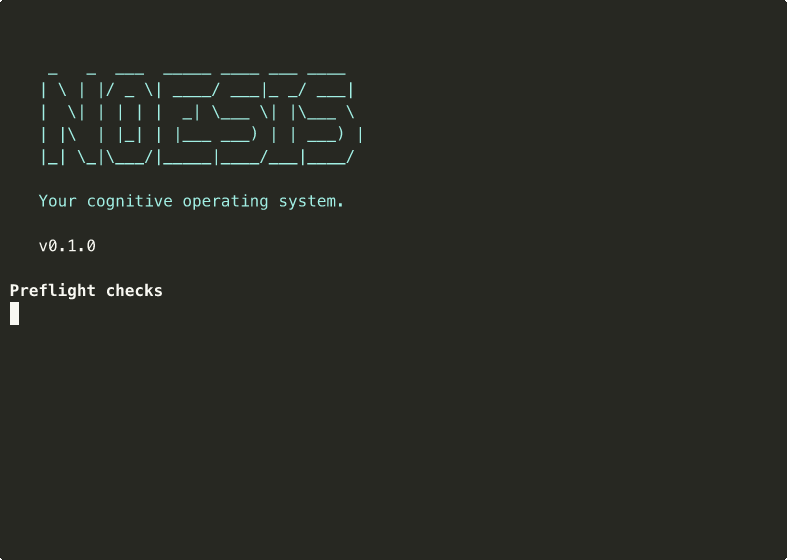
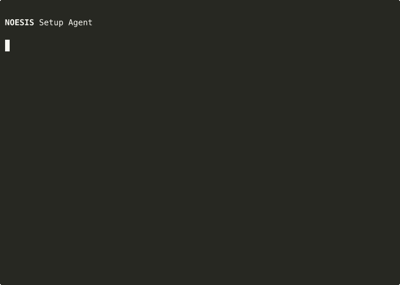
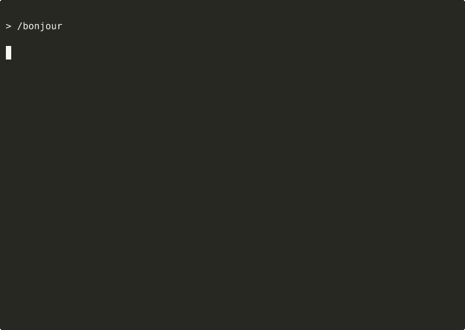

# NOESISGEN Light

**Turn your chaos into a universe.**

A personal OS for people who think in parallel. It learns who you are and how you think, not just what you ask.

---

## What is this?

NoesisGen Light is a **starter kit** for building your own cognitive OS — open source, built on [Claude Code](https://docs.anthropic.com/en/docs/claude-code).

It gives you the foundations: a vault structure, 7 skills, 2 subagents, and a setup agent that personalizes everything to you. What you build from there is yours.

Most AI tools ask you questions and store the answers. NoesisGen does the opposite — it scans your files, your writing, your structure first, then asks what the scan couldn't find. The knowledge isn't what you tell it. It's what it goes looking for.

Think of it as cognitive epigenetics: you don't change how your brain works — you change the environment so it can work better.

Extracted from NOESIS, a system used daily by a nonlinear author to manage 15+ creative projects in parallel.

## Install

```bash
npx get-noesisgen-light
```



**Requirements:**
- macOS or Linux
- Node.js 18+
- [Claude Code](https://docs.anthropic.com/en/docs/claude-code) installed
- Anthropic Subscription Plan (Pro or Max)

## What happens

The installer sets up your vault, skills, and templates in under a minute. Then you launch `claude` inside your vault and the setup agent takes over.

The setup adapts to you — no mode to choose. Answer briefly and it moves fast. Elaborate and it goes deeper.

| Short answers (~5-10 min) | Elaborate answers (~15-30 min) |
|---|---|
|  |  |

The setup follows this sequence:

1. **Banner** — system introduction
2. **Silent scan** — machine exploration
3. **Conversation** — 5 themes, one question at a time
4. **Voice analyzer** — studies how you write to calibrate its tone 
5. **Generation** — profile, projects, objectives. All markdown, all editable
6. **Banner final** — summary + next steps

After setup, `CLAUDE.local.md` keeps learning. Every session makes it sharper.

## Why NoesisGen?

1. **It reads your files, not just your answers.** Other tools ask you to describe yourself. NoesisGen scans your existing work — writing style, project state, creative patterns — and discovers what you didn't think to mention.

2. **Voice DNA, not just rules.** Cursor/Windsurf give your AI coding rules. NoesisGen gives your AI your *voice* — how you think, write, and create.

3. **Built for creative neurodivergent minds.** Not another productivity tool. A cognitive extension designed for people whose brains work differently — with built-in gamification, autonomous sessions, and a system that celebrates progress instead of punishing deviation.

## Tested

8 parallel setup tests on Claude Sonnet, 8 different profiles across 4 languages:

| Profile | Language | Type | Score |
|---------|----------|------|-------|
| Lea | FR | Freelance designer, ADHD | ✅ |
| Marcos | ES | Developer, multi-project | ✅ |
| Daniel | EN | CEO, strategic thinker | ✅ |
| Chloe | FR | Evasive, minimal answers | ✅ |
| Thomas | FR | Anxious, detail-oriented | ✅ |
| Elena | FR | Research scientist | ✅ |
| James | EN | Showrunner, fast-paced | ✅ |
| Yuki | JA | Game developer | ✅ |

**8/8 complete.** Average quality score: 94.1/100. Each generated a unique system name (Nyx, KERN, AXIS, LUNA, LUMEN, Synapse, SLATE) and a fully personalized vault.

## How it's different

| | NoesisGen | Generic AI assistants |
|---|---|---|
| **Intake** | Scans your files + conversation | Conversation only |
| **Depth** | Analyzes your code, writing, structure | Surface-level questions |
| **Persistence** | Plain markdown files you control | Opaque memory or none |
| **Identity** | Voice analyzer + scan/identity coherence check | No verification |
| **Autonomy** | Background session templates (configurable) | Nothing without you |
| **Control** | Everything readable and editable | Black box |

## Architecture

```
~/Desktop/Noesis/
├── USER.ENV/          ← You. Profile, portrait, voice DNA, objectives.
│                        Read-only for the AI. Write with permission.
├── SHARED.ENV/        ← Shared space. Daily notes, registries, task queue,
│                        captures. Both you and the AI write here.
└── AI.ENV/            ← AI only. Reflections, analyses, outputs, logs.
                         You read it, the AI maintains it.
```

Plus:
- `CLAUDE.md` — the source code of your system's personality
- `CLAUDE.local.md` — cumulative learning, session after session
- `.claude/skills/` — slash commands

## Skills




| Command | What it does | What you get |
|---------|-------------|-------------|
| `/bonjour` | Morning check-in | Returns a briefing with today's priorities, pending tasks, and project momentum scores. |
| `/sync` | Mid-session context reload | Returns a snapshot of all active threads, blockers, and where you left off. |
| `/status` | Full dashboard | Returns a table with every active project, its phase, last touch date, and next action. |
| `/recap` | End of session | Returns a session summary for you to review and correct before it's stored. |
| `/task` | Add a task | Returns a clarified task with subtasks and suggests autonomous actions if relevant. |
| `/deepwork` | Deep creative mode | Loads full project context and returns the previous step done and the next step ahead. |
| `/profile-deep` | Deep profile conversation | Returns updated profile data, propagated into your system after your validation. |

## Background agents (templates)

NoesisGen Light includes four LaunchAgent templates you can configure to let your system run without you:

| Template | What it does | What you get |
|----------|-------------|-------------|
| **Daily digest** | Morning briefing compiled from your files | Returns a markdown note with yesterday's progress, today's priorities, and stale projects flagged. |
| **Autonomous session** | Scheduled analysis and task completion | Processes your task queue, completes what it can, and logs decisions and blockers for your review. |
| **Inbox watcher** | Reacts to file changes in real time | Detects new or modified files and triggers captures, summaries, or task creation based on your rules. |
| **Maintenance** | Log rotation, cleanup, health checks | Rotates logs, archives old daily notes, and reports vault health issues if any. |

These are starting points. Configure them with your paths, your schedule, your rhythm.

## What's next

NoesisGen Light is the free, open source foundation. If you want to go further:

- **[When AI Gets You](https://whenaigetsyou.substack.com)** — the NoesisGen community on Substack. Free articles on building your system + paid tiers for deeper guides and workshops. The full NoesisGen template will be part of the paid tier.
- **NoesisPro** — [1:1 sessions](https://ginoftn.com/noesisgen) ($199–899). Built with you, calibrated to your cognitive profile.

Both tiers are about expertise, not code. The code is the support — the value is in the calibration.

## Credits

Created by [Gino Fontana](https://ginoftn.com) with the help of NOESIS.
Built on [Claude Code](https://docs.anthropic.com/en/docs/claude-code) by Anthropic.

## License

[MIT](LICENSE)
